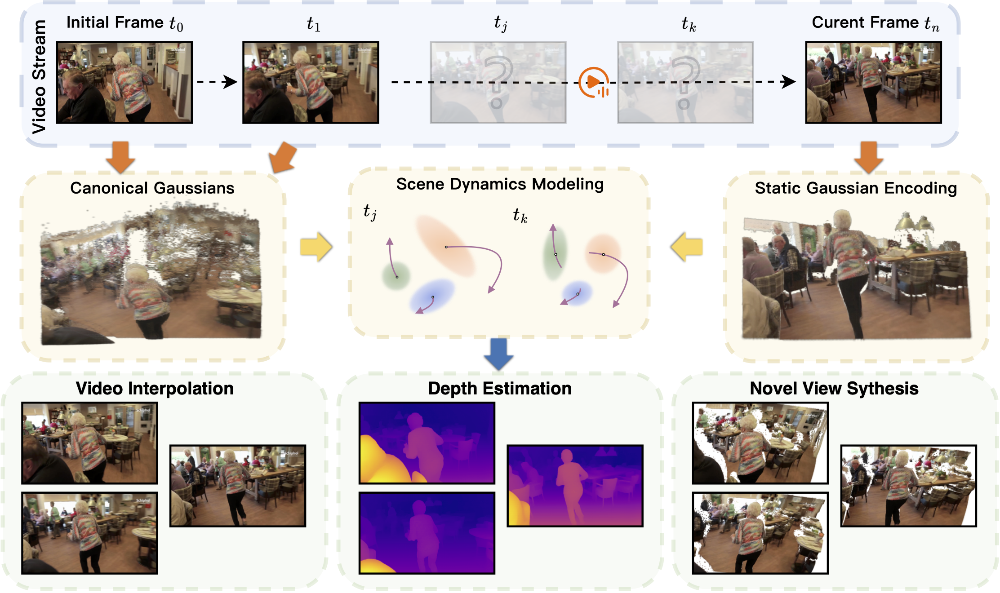

# StreamSplat: Towards Online Dynamic 3D Reconstruction from Uncalibrated Video Streams

    

## Videos

https://github.com/user-attachments/assets/d72b75de-e07a-4d81-a23f-f85e99c9bd05

https://github.com/user-attachments/assets/d975b425-1e4c-4dc9-8398-0a1a43d50e67

https://github.com/user-attachments/assets/d2a064f5-f4d7-46c4-8a3a-28fcb8679df5

https://github.com/user-attachments/assets/466a222d-f3b5-447a-84c0-a47538071c05

## Checklist
- [ ] Release inference code and pretrained checkpoint
- [ ] Release training code

